# Task 1 — Local Kafka & Redpanda Multi-Broker Clusters

## Directory layout

```
task1/
├── kafka/
│   └── docker-compose.yml   # 3-broker Apache Kafka KRaft cluster + kafka-ui
└── redpanda/
    └── docker-compose.yml   # 3-broker Redpanda cluster + Redpanda Console
```

---

## Part 1 — Apache Kafka (KRaft, 3 brokers)

### Architecture

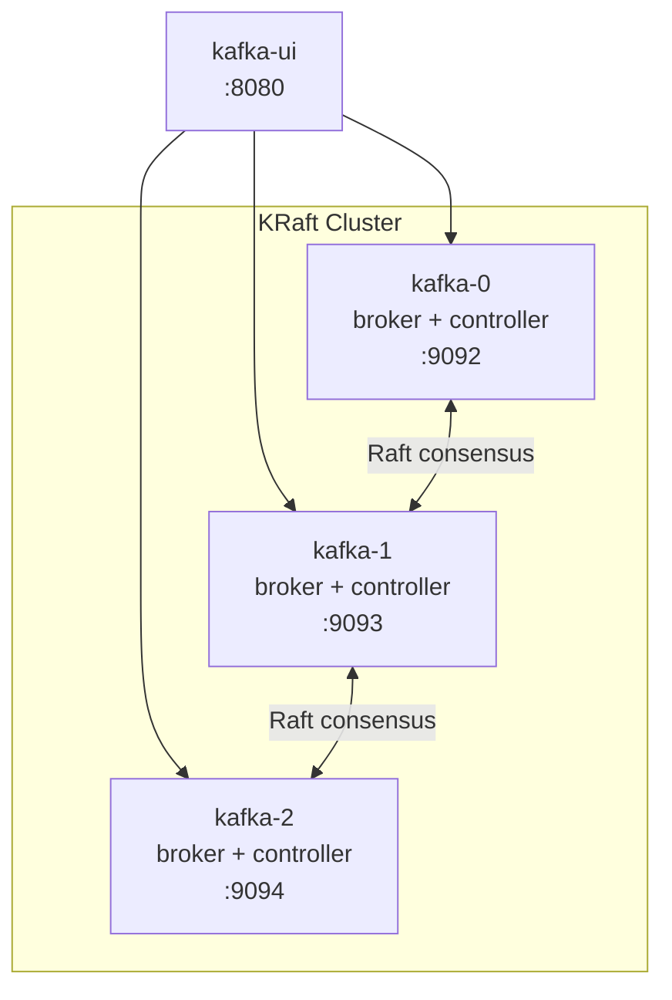

**KRaft mode** (Kafka 3.x): no ZooKeeper — each broker also participates in the Raft-based controller quorum.  
Replication factor 3 → every partition survives loss of 1 broker.

### Start the cluster

```bash
cd task1/kafka
docker compose up -d
docker ps
```
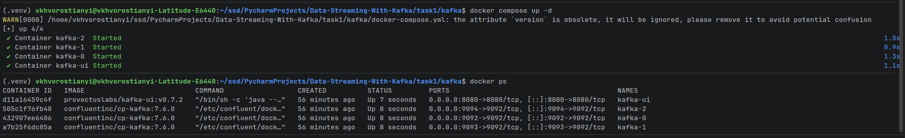


### Kafka CLI — all commands run via `docker exec`

#### 1. Create a topic

```bash
docker exec kafka-0 kafka-topics \
  --bootstrap-server kafka-0:9092,kafka-1:9092,kafka-2:9092 \
  --create \
  --topic demo.messages.sent \
  --partitions 3 \
  --replication-factor 3
```
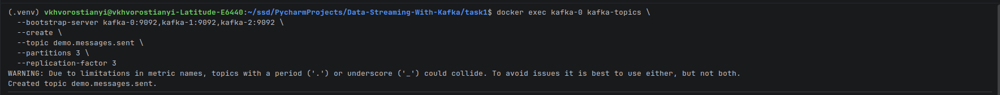

#### 2. List topics

```bash
docker exec kafka-0 kafka-topics \
  --bootstrap-server kafka-0:9092,kafka-1:9092,kafka-2:9092 \
  --list
```
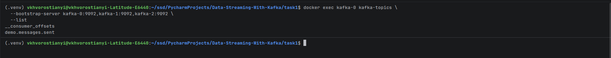

#### 3. Describe the topic (bonus — shows partition leaders and replicas)

```bash
docker exec kafka-0 kafka-topics \
  --bootstrap-server kafka-0:9092,kafka-1:9092,kafka-2:9092 \
  --describe \
  --topic demo.messages.sent
```
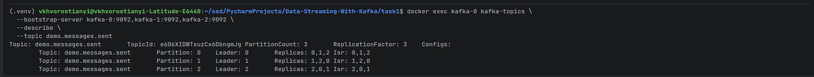

#### 4. Produce at least 10 messages (console producer)

Type each line and press Enter; press `Ctrl+C` to stop.

```bash
docker exec -it kafka-0 kafka-console-producer \
  --bootstrap-server kafka-0:9092,kafka-1:9092,kafka-2:9092 \
  --topic demo.messages.sent
```
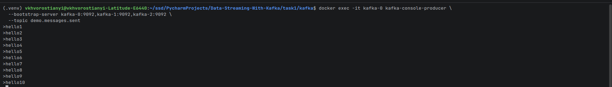

#### 5. Consume messages (console consumer)

Open a second terminal. `--from-beginning` replays all stored messages.

```bash
docker exec -it kafka-0 kafka-console-consumer \
  --bootstrap-server kafka-0:9092,kafka-1:9092,kafka-2:9092 \
  --topic demo.messages.sent \
  --from-beginning
```
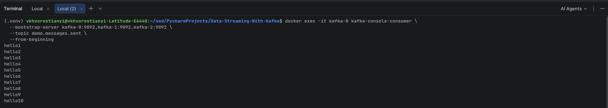


#### 6. Delete the topic

```bash
docker exec kafka-0 kafka-topics \
  --bootstrap-server kafka-0:9092,kafka-1:9092,kafka-2:9092 \
  --delete \
  --topic demo.messages.sent
```
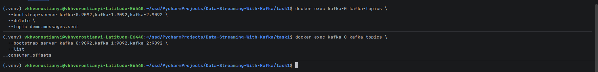

```bash
# Show KRaft quorum leader
docker exec kafka-0 kafka-metadata-quorum \
  --bootstrap-server kafka-0:9092 \
  describe --status
```
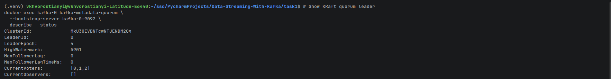

### Stop and clean up

```bash
docker compose down -v   # removes containers AND volumes
```

---

## Part 2 — Redpanda (3 brokers)

### Architecture

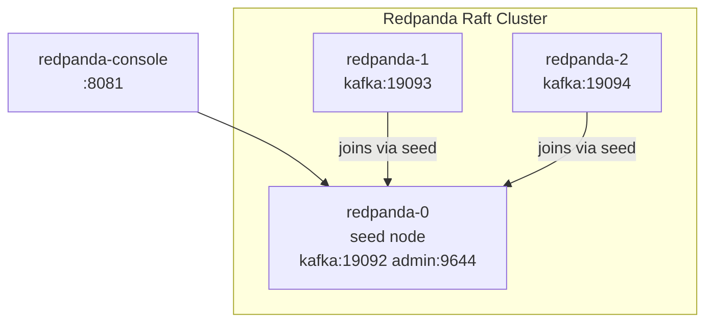

Redpanda uses its own Raft-based consensus — no ZooKeeper, no KRaft.  
It is Kafka-API compatible: standard Kafka clients work without modification.

### Start the cluster

```bash
cd task1/redpanda
docker compose up -d
docker ps
```
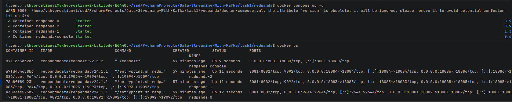

#### 1. Check cluster health

```bash
docker exec redpanda-0 rpk cluster health \
  --api-urls redpanda-0:9644
```
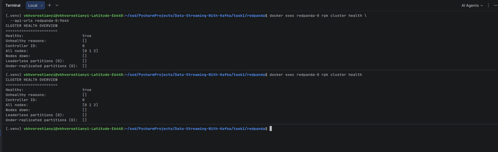

#### 2. List brokers

```bash
docker exec redpanda-0 rpk cluster info \
  --brokers redpanda-0:9092,redpanda-1:9092,redpanda-2:9092
```
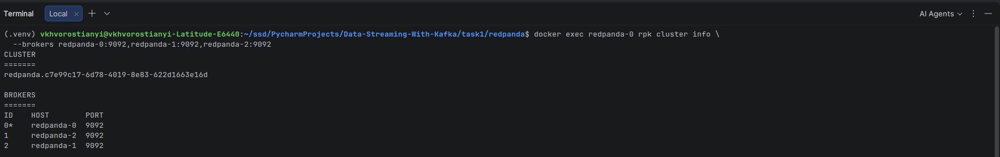

#### 3. Create a topic

```bash
docker exec redpanda-0 rpk topic create demo.messages.sent \
  --brokers redpanda-0:9092,redpanda-1:9092,redpanda-2:9092 \
  --partitions 3 \
  --replicas 3
```
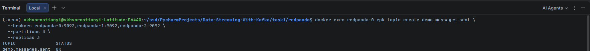

#### 4. List topics

```bash
docker exec redpanda-0 rpk topic list \
  --brokers redpanda-0:9092,redpanda-1:9092,redpanda-2:9092
```
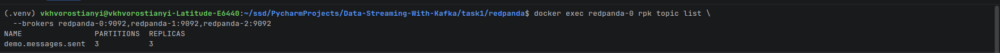

#### 5. Describe the topic

```bash
docker exec redpanda-0 rpk topic describe demo.messages.sent \
  --brokers redpanda-0:9092,redpanda-1:9092,redpanda-2:9092
```
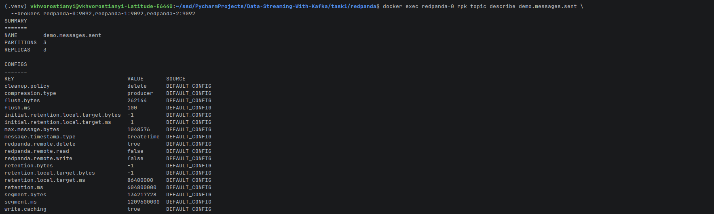

#### 6. Produce at least 10 messages
```bash
docker exec -it redpanda-0 rpk topic produce demo.messages.sent \
  --brokers redpanda-0:9092,redpanda-1:9092,redpanda-2:9092
```
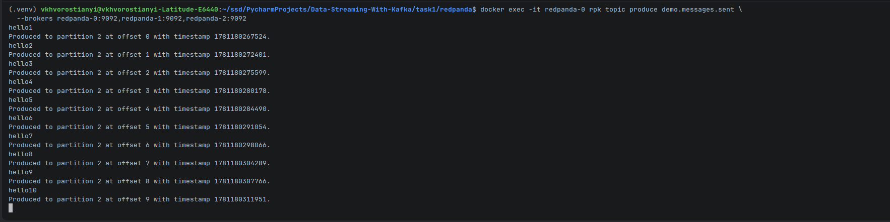

#### 7. Consume messages

```bash
docker exec -it redpanda-0 rpk topic consume demo.messages.sent \
  --brokers redpanda-0:9092,redpanda-1:9092,redpanda-2:9092 \
  --offset start
```
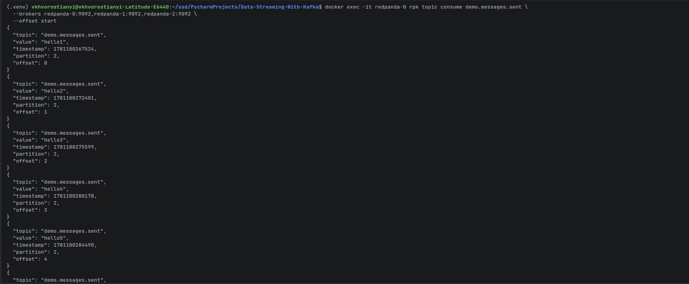

#### 8. Delete the topic

```bash
docker exec redpanda-0 rpk topic delete demo.messages.sent \
  --brokers redpanda-0:9092,redpanda-1:9092,redpanda-2:9092
```
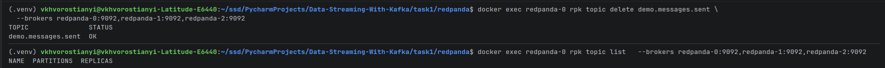
---

## Key differences: Kafka vs Redpanda

| Feature | Apache Kafka | Redpanda |
|---|---|---|
| Consensus | KRaft (Raft in JVM) | Native Raft (C++) |
| Runtime | JVM | Native binary |
| ZooKeeper | Not needed (3.x+) | Never needed |
| CLI | `kafka-*.sh` scripts | `rpk` single binary |
| Schema Registry | Separate service | Built-in |
| HTTP Proxy | Separate service (REST Proxy) | Built-in (PandaProxy) |
| Throughput | High | Higher (lower latency) |
| Kafka API compat | 100% (it is Kafka) | ~100% (compatible) |

---
## Conclusion
- Both clusters are up and running with 3 brokers each, using Raft-based consensus without ZooKeeper.
- We successfully created topics, produced and consumed messages, and managed the clusters using their respective CLIs.
- Redpanda offers a more streamlined experience with built-in features and better performance, while Kafka has a more mature ecosystem and wider adoption.