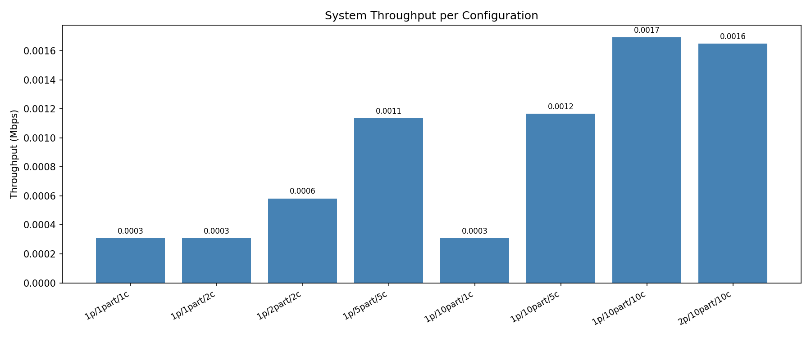
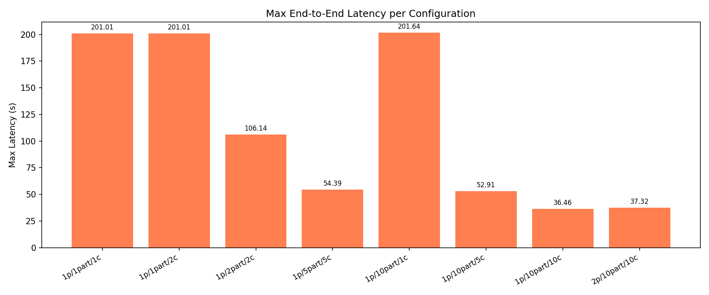

# Task 2 — Kafka Distributed Streaming Experiment

Measures **throughput (Mbps)** and **max end-to-end latency (s)** for 8 producer/partition/consumer configurations using Redpanda and synthetic Reddit comment data.

## Architecture

```
[Producer x N] → Redpanda (single broker) → [Consumer x M] → /logs/<exp>/*.csv
                                                                      ↓
                                                             [Aggregator] → /reports/
```

### Services

| Service | Description |
|---------|-------------|
| **producer** | Generates synthetic Reddit comments with Faker, sends to Kafka with embedded `send_timestamp` |
| **consumer** | Receives messages, sleeps 1 s (simulated processing), writes CSV log |
| **aggregator** | Reads all CSVs, computes metrics, plots throughput and latency graphs |

### Dataset

Synthetic Reddit comments (300–600 bytes each) generated with `Faker` and a fixed seed (`FAKER_SEED=42`) for reproducibility. No external download needed.

### Consumer CSV schema

```
consumer_id, message_id, comment_created_utc, send_timestamp,
receive_timestamp, finish_timestamp, payload_bytes
```

### Metrics

| Metric | Formula |
|--------|---------|
| `throughput_mbps` | `total_bytes / (last_finish − first_send) / 1 000 000` |
| `max_latency_s` | `max(finish_timestamp − send_timestamp)` |

---

## Prerequisites

- Docker ≥ 24 with the Compose plugin (`docker compose version`)
- 4 GB RAM free for Redpanda + 10 consumer containers

---

## Quick Start (smoke test)

```bash
cd task2

# Single producer, 1 partition, 1 consumer, 5 messages
export NUM_PRODUCERS=1 NUM_PARTITIONS=1 NUM_MESSAGES=5 EXP_LABEL=smoke

docker compose up --build \
  --scale producer=1 --scale consumer=1 \
  -d redpanda producer consumer

# Wait for everything to finish
docker compose ps -q producer | xargs docker wait
docker compose ps -q consumer | xargs docker wait

# Check logs
ls logs/smoke/
cat logs/smoke/*.csv
```

Expected: one CSV file with 5 data rows; `finish_timestamp − receive_timestamp ≥ 1.0` for every row.

---

## Run All 8 Experiments

```bash
cd task2
bash scripts/run_experiments.sh
```

The script runs the following configurations in sequence:

| # | Producers | Partitions | Consumers | Expected behaviour |
|---|-----------|------------|-----------|-------------------|
| 01 | 1 | 1 | 1 | Baseline: ~1 msg/s |
| 02 | 1 | 1 | 2 | 2nd consumer idle — partition is the bottleneck |
| 03 | 1 | 2 | 2 | ~2 msg/s; each consumer owns 1 partition |
| 04 | 1 | 5 | 5 | ~5 msg/s |
| 05 | 1 | 10 | 1 | ~1 msg/s; single consumer reads all 10 partitions |
| 06 | 1 | 10 | 5 | ~5 msg/s |
| 07 | 1 | 10 | 10 | ~10 msg/s |
| 08 | 2 | 10 | 10 | ~10 msg/s; dataset split across 2 producers |

`NUM_MESSAGES` defaults to **200**. Override before running:

```bash
NUM_MESSAGES=500 bash scripts/run_experiments.sh
```

---

## View Results

After all experiments finish:

```bash
# Summary table
cat reports/summary.csv

# Charts
xdg-open reports/throughput.png
xdg-open reports/latency.png
```

---

## Run Aggregator Standalone

If you want to regenerate the report without re-running experiments:

```bash
docker compose --profile aggregate run --rm \
  -e LOG_DIR=/logs -e REPORT_DIR=/reports \
  aggregator
```

---

## Configuration Reference

| Variable | Default | Description |
|----------|---------|-------------|
| `NUM_MESSAGES` | `200` | Total messages per experiment |
| `NUM_PRODUCERS` | `1` | Number of producer replicas |
| `NUM_PARTITIONS` | `1` | Topic partition count |
| `NUM_CONSUMERS` | `1` | Number of consumer replicas |
| `FAKER_SEED` | `42` | Seed for reproducible data generation |
| `EXP_LABEL` | `smoke` | Sub-directory name under `logs/` |
| `BOOTSTRAP_SERVERS` | `redpanda:9092` | Kafka bootstrap address |
| `GROUP_ID` | `reddit-consumers` | Consumer group id |

---

## Cleanup

```bash
docker compose down -v --remove-orphans
rm -rf logs/*/  reports/summary.csv reports/*.png
```

---

## Experiment Results

200 messages per experiment, ~300–600 bytes each, 1 s simulated processing sleep per message.

### Summary table

| # | Producers | Partitions | Consumers | Messages | Throughput (Mbps) | Max Latency (s) |
|-------|-----------|------------|-----------|----------|-------------------|-----------------|
| exp01 | 1 | 1 | 1 | 200 | 0.000307 | 201.01 |
| exp02 | 1 | 1 | 2 | 200 | 0.000308 | 201.01 |
| exp03 | 1 | 2 | 2 | 200 | 0.000582 | 106.14 |
| exp04 | 1 | 5 | 5 | 200 | 0.001134 | 54.39 |
| exp05 | 1 | 10 | 1 | 200 | 0.000307 | 201.64 |
| exp06 | 1 | 10 | 5 | 200 | 0.001167 | 52.91 |
| exp07 | 1 | 10 | 10 | 200 | 0.001692 | 36.46 |
| exp08 | 2 | 10 | 10 | 200 | 0.001650 | 37.32 |

### Throughput



### Latency



### Key observations

**Partitions alone do not improve throughput** (exp01 vs exp05): adding partitions without adding consumers achieves the same throughput — the processing bottleneck is always the number of active consumers, not the number of partitions.

**The effective parallelism is `min(partitions, consumers)`** (exp02): with 1 partition and 2 consumers, the second consumer is assigned no partition by the group coordinator and remains idle, yielding identical throughput to exp01.

**Throughput scales linearly with active consumers** up to the partition limit: 1c → 0.000307 Mbps, 2c → 0.000582, 5c → ~0.00115, 10c → 0.00169 — roughly N× the baseline per added consumer.

**Max latency falls proportionally**: with 10 consumers each handling ~20 messages, max latency drops to ~36 s vs 201 s with a single consumer — confirming that latency is dominated by queue depth divided by consumer throughput.

**Adding a second producer (exp08 vs exp07) has no measurable effect**: both producers feed the same 10 partitions and 10 consumers; the consumer side remains the bottleneck.
