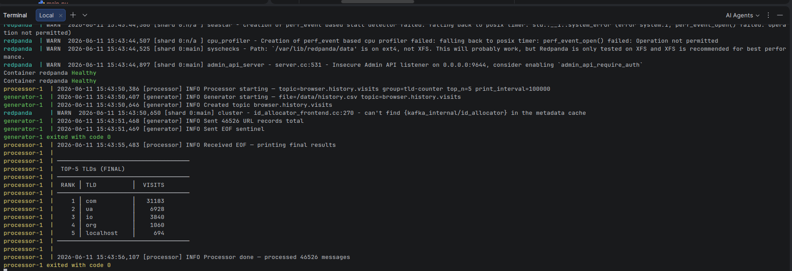

# Task 3 — Browser History Kafka Streaming App

Streams browser-history URL visits through Redpanda and computes the **top-5 root TLDs** (com, org, ua, io, …) by visit count.

## Architecture

```
[data/history.csv]
      │
      ▼
[generator] ──► Redpanda (browser.history.visits, 1 partition) ──► [processor] ──► stdout
```

| Service | Description |
|---------|-------------|
| **generator** | Reads `history.csv`, sends each row as a JSON message; sends one EOF sentinel when done |
| **processor** | Consumes messages, extracts TLD with `tldextract`, prints top-5 every 50 messages and a final table on EOF |

## Dataset

Place your exported browser history CSV at `data/history.csv` before running. The file must have at least a `url` column; `title` and `visit_time` are optional.

## Run

```bash
cd task3
docker compose up --build
```

The processor prints intermediate and final top-5 tables to stdout. Both containers exit automatically when all records have been processed.

```bash
# Watch processor output only
docker compose logs -f processor

# Cleanup
docker compose down -v
```

## Configuration

| Variable | Default | Description |
|----------|---------|-------------|
| `TOPIC` | `browser.history.visits` | Kafka topic name |
| `TOP_N` | `5` | Number of top TLDs to display |
| `PRINT_INTERVAL` | `100000` | Print standings every N messages |
| `GROUP_ID` | `tld-counter` | Consumer group id |

## Result


